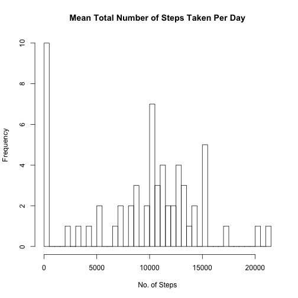
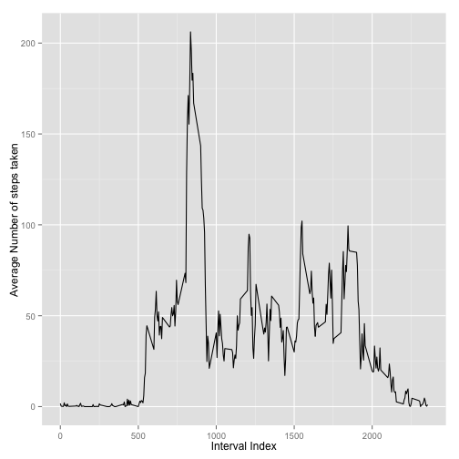
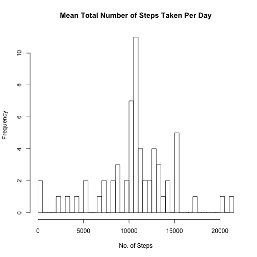
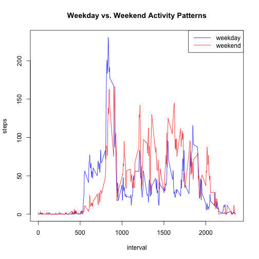

## Loading and preprocessing the data

```r
data <- read.csv("activity.csv", header = TRUE)
summary(data)
```

```
##      steps                date          interval     
##  Min.   :  0.00   2012-10-01:  288   Min.   :   0.0  
##  1st Qu.:  0.00   2012-10-02:  288   1st Qu.: 588.8  
##  Median :  0.00   2012-10-03:  288   Median :1177.5  
##  Mean   : 37.38   2012-10-04:  288   Mean   :1177.5  
##  3rd Qu.: 12.00   2012-10-05:  288   3rd Qu.:1766.2  
##  Max.   :806.00   2012-10-06:  288   Max.   :2355.0  
##  NA's   :2304     (Other)   :15840
```

## What is mean total number of steps taken per day?

```r
total.steps <- tapply(data$steps, data$date, sum, na.rm=TRUE)
hist(total.steps, breaks = 50, main = "Mean Total Number of Steps Taken Per Day", xlab = "No. of Steps")
```

 

Mean number of steps taken per day:

```r
mean(total.steps)
```

```
## [1] 9354.23
```

Median number of steps taken per day:

```r
median(total.steps)
```

```
## [1] 10395
```

## What is the average daily activity pattern?
5-minute interval (x-axis) and the average number of steps taken, averaged across all days (y-axis):

```r
average.steps <- aggregate(x=list(steps=data$steps), by=list(interval=data$interval),FUN=mean, na.rm=TRUE)
ggplot(data=average.steps, aes(x=interval, y=steps)) +
geom_line() +
xlab("Interval Index") +
ylab("Average Number of steps taken")
```

 

The following 5-minute interval, on average across all the days in the dataset, contains the maximum number of steps:


```r
average.steps[which.max(average.steps$steps), "interval"]
```

```
## [1] 835
```

## Imputing missing values
Total # of Missing Values:

```r
sum(is.na(data))
```

```
## [1] 2304
```

Impute missing values with means of the interval:

```r
# Replace each missing value with the mean value of its 5-minute interval
replace.missing <- function(steps, interval) {
    imputed <- NA
    if (!is.na(steps))
        imputed <- c(steps)
    else
        imputed <- (average.steps[average.steps$interval==interval, "steps"])
    return(imputed)
}
imputed.data <- data
imputed.data$steps <- mapply(replace.missing, imputed.data$steps, imputed.data$interval)
```

Histogram of total number of steps taken each day with imputed data:

```r
total.steps.imputed <- tapply(imputed.data$steps, imputed.data$date, sum, na.rm=TRUE)
hist(total.steps.imputed, breaks = 50, main = "Mean Total Number of Steps Taken Per Day", xlab = "No. of Steps")
```

 

Mean number of steps taken per day:

```r
mean(total.steps.imputed)
```

```
## [1] 10766.19
```

Median number of steps taken per day:

```r
median(total.steps.imputed)
```

```
## [1] 10766.19
```

Mean and median values are higher after imputing data.

## Are there differences in activity patterns between weekdays and weekends?


```r
#Creating a factor variable to determine if date is weekend or weekday
is.day.weekend <- function(date) {
    day <- weekdays(date)
    if (day %in% c("Saturday", "Sunday"))
        return("weekend")
    else
        return("weekday")
}
imputed.data$date <- as.Date(imputed.data$date)
imputed.data$day <- sapply(imputed.data$date, FUN=is.day.weekend)
```

Time Series Plot showing differences in activity patterns between weekdays and weekends:
 
